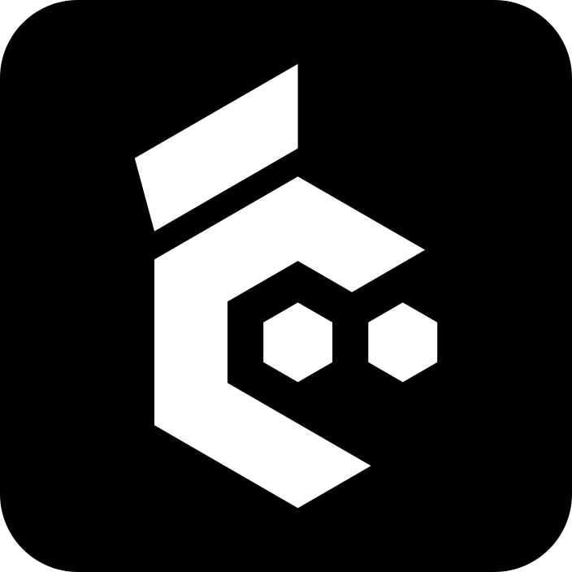
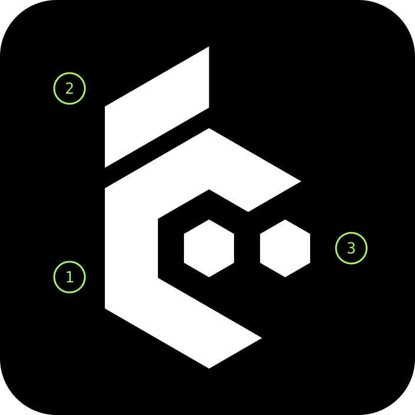
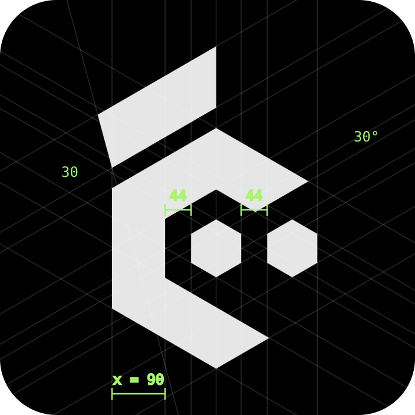
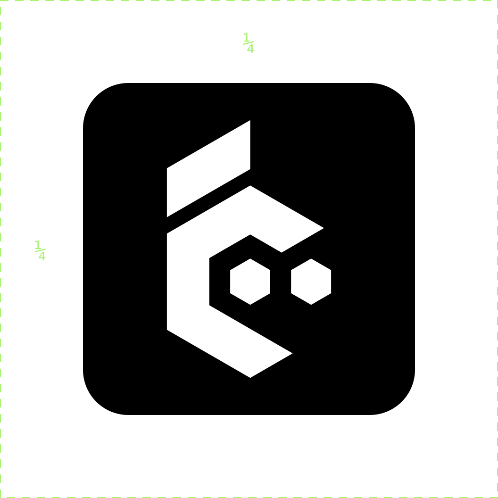
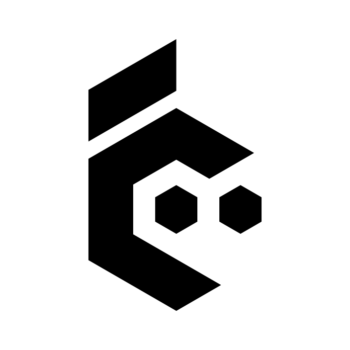
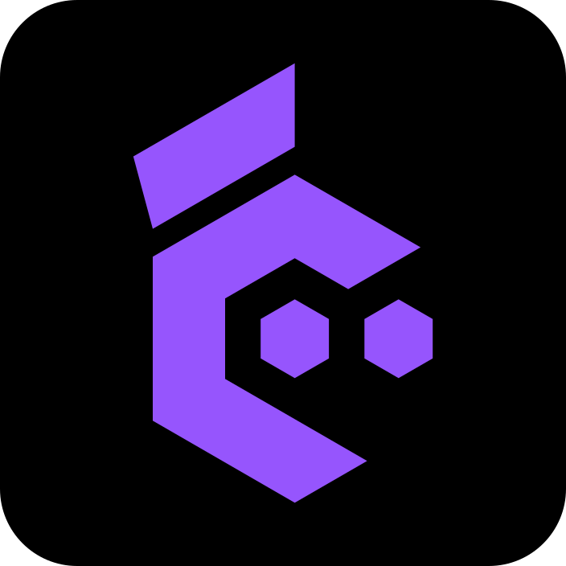
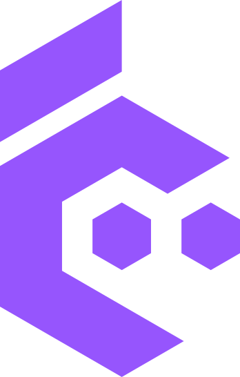

# cezar brand guidelines

How the cezar mark is built, which colours it comes in, and what not to do with it.
The mark is constructed from geometry, not traced, so every logo file comes from one
script and always looks the same.

  

## The mark

1. **Hexagonal C.** A regular hexagon open to the right. The upper arm is longer and cut
   at 30 degrees; the lower arm ends in a sharp wedge.
2. **Laurel leaf.** Parallel to the upper-left edge of the C, separated from it by a gap
   of a third of the stroke. The left end is slanted and sticks out past the C; the right
   end is vertical and stops on the axis of the top vertex.
3. **Two dots.** Identical regular hexagons on the horizontal axis of the C, equally
   spaced from each other and from the inside of the letter.

## Construction

The edges of the mark run in three directions: vertical, 30 and 150 degrees. The one
exception is the slanted left end of the leaf (105 degrees), which gives the mark its
character. Measurements are in tile units (the tile is 704 u). The base measure is x, the stroke
width.

| Element | Value |
| --- | --- |
| Tile | 704 × 704 u, corner radius 96 u |
| Stroke (x) | 90 u, for the C and the leaf |
| Hexagonal C | regular, radius 204 u |
| Edge directions | 90°, 30°, 150° |
| Dots | regular hexagons, radius 49 u |
| Dot gaps | 44 u (about ½ x), both equal |
| Leaf gap | 30 u (⅓ x) |
| Leaf ends | left slanted at 105°, right vertical |
| Position | centred in the tile |

## Clear space and minimum size

Keep a quarter of the tile width clear around the icon: no text, other logos or image
edges inside it. The mark without a tile keeps x of clear space on every side.

The icon with its tile works down to 16 px (favicon). The mark alone should be at least
20 px tall, and the mark with the name at least 88 px wide.

## Colour versions

The mark is black and white first, the same colours the cockpit icon uses. White on
black has a contrast of 21:1, so it works at every size. Brand violet on black is for
places where the mark should read as the brand: at 5:1 it holds up from 32 px, and
small sizes such as the favicon stay white.

| | File | Use | Contrast |
| --- | --- | --- | --- |
|  | `cezar-icon-black.svg` | main icon: app, favicon, avatars, GitHub | 21:1 |
|  | `cezar-icon-white.svg` | light pages and documents | 21:1 |
|  | `cezar-icon-violet.svg` | avatars, stickers, social, from 32 px | 5:1 |
| | `cezar-mark-white.svg` | mark without a tile on dark backgrounds: nav, footer, slides | 19.5:1 on #0E0C10 |
|  | `cezar-mark-black.svg` | mark without a tile on light backgrounds and one-colour print | 21:1 |
|  | `cezar-mark-violet.svg` | mark without a tile on the dark page background, large formats | 4.7:1 on #0E0C10 |

## Mark with name

The name is always lower case: **cezar**. It is set in
[Chakra Petch](https://fonts.google.com/specimen/Chakra+Petch) SemiBold (600) with no
tracking change; its cut corners echo the angles of the mark. The mark is 1.5 times the
font size tall and sits 0.6 of the font size from the name. In the landing page
navigation that is a 26 px mark and a 19 px name.

## Colours

| Colour | Hex | Use |
| --- | --- | --- |
| Tile black | `#000000` | icon tile, mark on light |
| Mark white | `#FFFFFF` | mark on dark |
| Brand violet | `#9655FD` | violet mark, brand blocks |
| Page background | `#0E0C10` | dark page background |
| Secondary text | `#A9A2AD` | descriptions, labels |

## Typography

| Role | Typeface |
| --- | --- |
| Logo and figures | Chakra Petch 600 |
| Headings | Archivo 500 |
| Body text | Inter 400 and 700 |
| Labels and code | JetBrains Mono 500 |

## Do not

- Stretch the mark. It only scales proportionally.
- Rotate it. It always stands upright on its 30-degree grid.
- Outline it. The mark is always filled.
- Add effects: no shadows, glows or gradients.
- Colour its parts differently. Every part of the mark has one colour.
- Put a black mark on the violet tile. At 4.1:1 the two mid-dark tones blur together at
  small sizes.

## Files

The six `cezar-icon-*` and `cezar-mark-*` files are generated by `scripts/build_mark.py`
in [open-mercato/cezar-landing](https://github.com/open-mercato/cezar-landing), which
holds the geometry of the mark. Change it there and copy the regenerated files here. The
three diagrams (`anatomy.svg`, `construction.svg`, `clearspace.svg`) are drawn from the
same coordinates.
